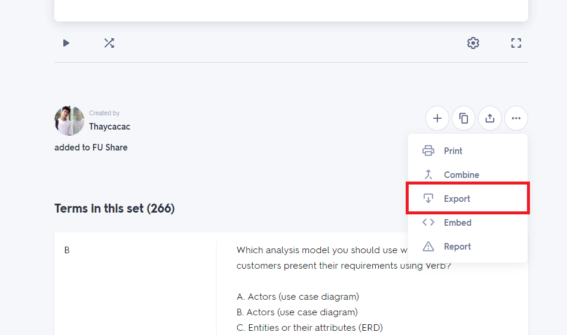
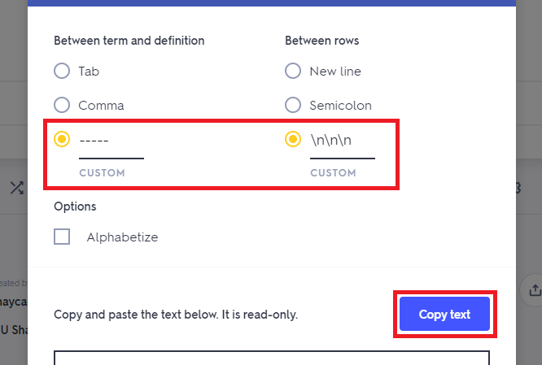
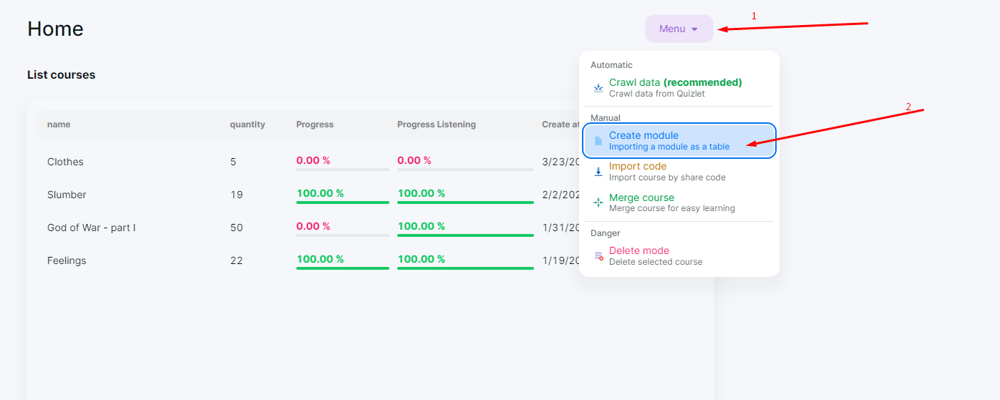
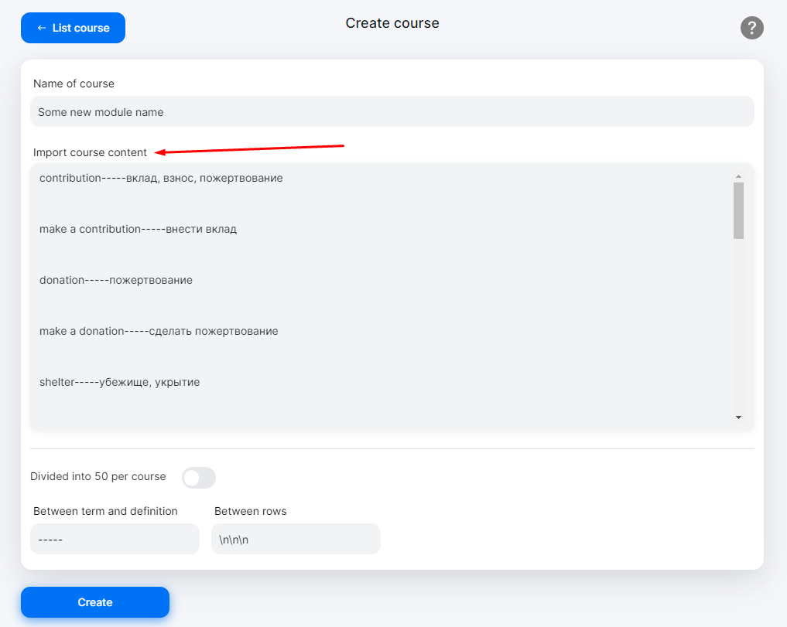
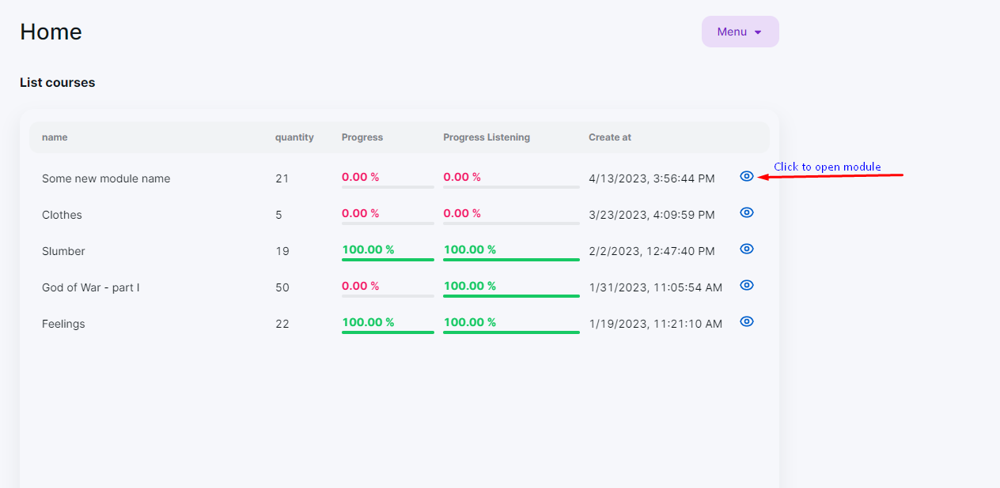
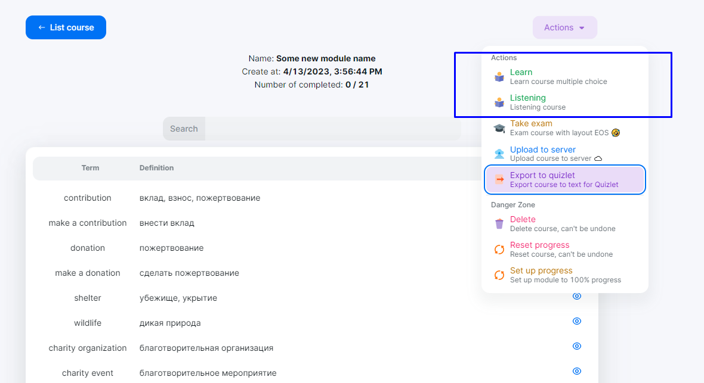

# Quizlet learn

## Introduction

<div style="text-align: center">
    
    
</div>

[](https://github.com/AdonisGM/quizlet-learn/actions/workflows/azure-static-web-apps-happy-coast-0ab73bc00.yml)

Quizlet is a free service that helps you study and improve your vocabulary. but it is not free for everyone. You need to pay for learning. You can use this service for free without paying.

## Target audience

This service is for student learn in FPT University.

## Features

- Free all time.
- Import from quizlet.
- Export to quizlet.
- Exam mode.

## Installation

Enviroment:

- Nodejs version: 14.x

```bash
npm install
npm start
```

After run this command, you can see the result in browser.

```bash
> quizlet-learn@0.1.0 start
> react-scripts start

(node:16744) [DEP_WEBPACK_DEV_SERVER_ON_AFTER_SETUP_MIDDLEWARE] DeprecationWarning: 'onAfterSetupMiddleware' option is deprecated. Please use the 'setupMiddlewares' option.
(Use `node --trace-deprecation ...` to show where the warning was created)
(node:16744) [DEP_WEBPACK_DEV_SERVER_ON_BEFORE_SETUP_MIDDLEWARE] DeprecationWarning: 'onBeforeSetupMiddleware' option is deprecated. Please use the 'setupMiddlewares' option.
Starting the development server...
Compiled successfully!

You can now view quizlet-learn in the browser.

  Local:            http://localhost:3000
  On Your Network:  http://192.168.1.5:3000

Note that the development build is not optimized.
To create a production build, use npm run build.

webpack compiled successfully
```
## Export course from Quizlet

- Step 1: Visit to course you want to learn.

- Step 2: Click on "Export" button.

<div style='text-align: center'>
  
</div>

- Step 3: Setup `Between term and definition` is "-----" and `Between rows` is "\n\n\n", Click button "Copy text".

<div style='text-align: center'>
  
</div>

- Step 4: Click "Create module" option in main menu.

<div style='text-align: center'>
  
</div>

- Step 5: Paste text from clipboard to textarea and input module name.

<div style='text-align: center'>
  
</div>

- Step 6: Click "Create" button and enjoy learning.

## Start learning or listening module

- Step 1: Click eye icon to open your module

<div style='text-align: center'>
  
</div>

- Step 2: Click desired action to start learning or listening
  The two actions are working although there are presented more

<div style='text-align: center'>
  
</div>
