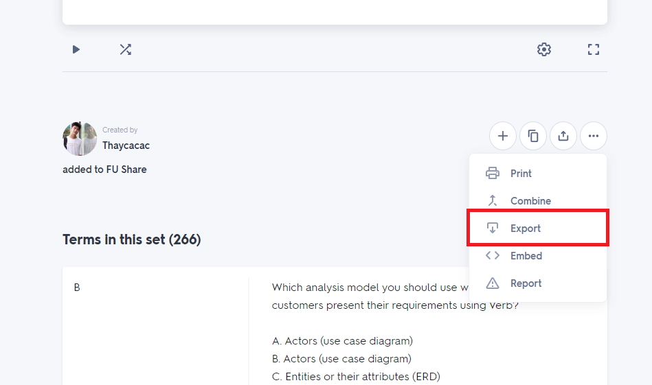
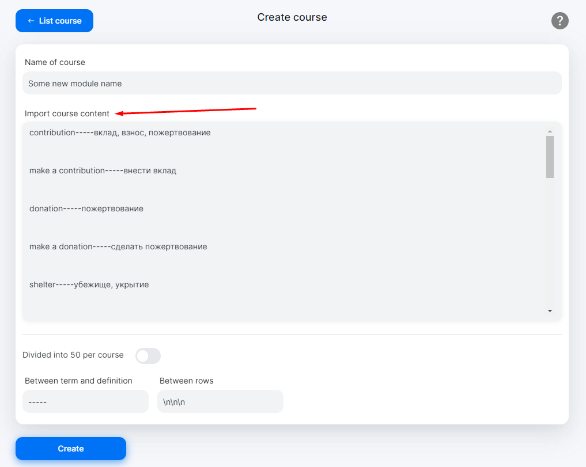
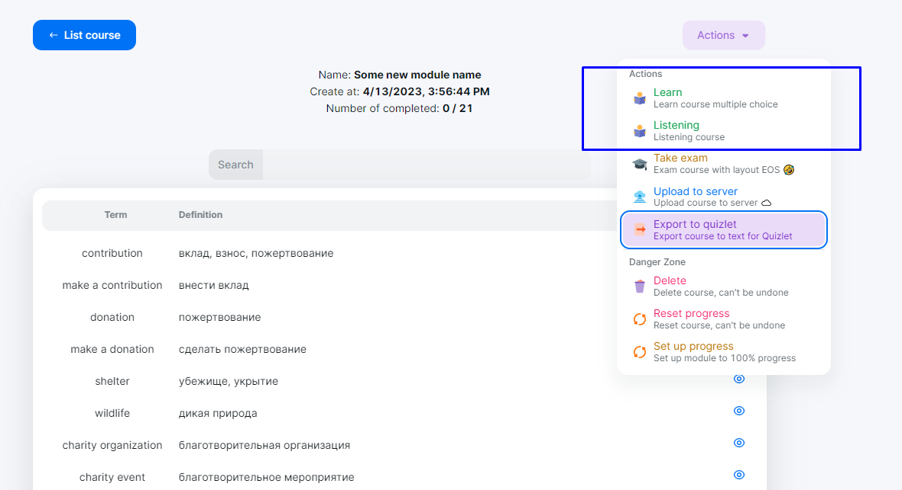

# Tutorial

## Export course from Quizlet

- Step 1: Visit to course you want to learn.

- Step 2: Click on "Export" button.

  

- Step 3: Setup `Between term and definition` is "-----" and `Between rows` is "\n\n\n", Click button "Copy text".

  

- Step 4: Click "Create module" option in main menu.

  

- Step 5: Paste text from clipboard to textarea and input module name.

  

- Step 6: Click "Create" button and enjoy learning.

## Start learning or listening module

- Step 1: Click eye icon to open your module

  

- Step 2: Click desired action to start learning or listening
The two actions are working although there are presented more

  

